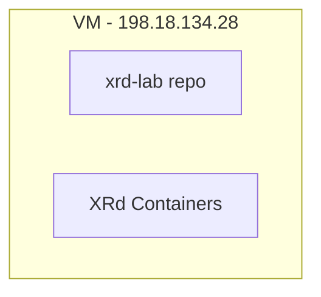

# DEVWKS-3337 - Building AI Agents for Network Operations with LangGraph

## Lab Overview

This repository contains resources and configurations for the Cisco Live workshop `DEVWKS-3337`.

> [!NOTE]  
> The VMs used are provided during the workshop. If you find this repository and want to try the instructions, you need to use your own VMs and update the IP from these instructions.

The workshop uses two virtual machines with the following roles:

- `198.18.134.28`
  - Host for XRd containers
- Workshop Laptop
  - Host for agents and tooling.



```mermaid
flowchart TD
    subgraph Workshop Laptop ~/DEVWKS-3337
        C[instructions & Ansible Playbooks]
        D[gnmi-buddy repo]
        E[sp_oncall repo]
    end
```

Working directory:

```bash
/home/devnet/DEVWKS-3337
~/DEVWKS-3337
/home/devnet/DEVWKS-3337/gNMIBuddy
```

### Repositories used

- **[xrd-lab](https://github.com/jillesca/XRd-Labs)** Contains all files to deploy Cisco XRd containers (docker-compose files, configs).

- **[gnmi-buddy](https://github.com/jillesca/gNMIBuddy)** gNMI Tool used by the Langgraph agents to connect to the network devices.

- **[sp_oncall](https://github.com/jillesca/sp_oncall)** The Graph of agents.

- **[DEVWKS-3337](https://github.com/jillesca/DEVWKS-3337)** This repo (the one you are reading now). Which contains step-by-step instructions, ansible playbooks and inventory

### Architecture Diagram

```mermaid
flowchart TD
    subgraph VM - 198.18.134.28
        A[XRd Containers]
    end

    subgraph Workshop Laptop ~/DEVWKS-3337
        D[sp_oncall]
        E[gnmi-buddy]
        D --> E
        E --> A
    end
```

## Credentials

| **System**           | **Username** | **Password** |
| -------------------- | ------------ | ------------ |
| **VM** 198.18.134.28 | `root`       | `C1sco12345` |
| **XRd devices**      | `admin`      | `C1sco123`   |

## Devices

The following table lists the devices and their corresponding IP addresses:

| **Device Name** | **IP Address** |
| --------------- | -------------- |
| `xrd-1`         | 198.18.158.16  |
| `xrd-2`         | 198.18.158.17  |
| `xrd-3`         | 198.18.158.18  |
| `xrd-4`         | 198.18.158.19  |
| `xrd-5`         | 198.18.158.20  |
| `xrd-6`         | 198.18.158.21  |
| `xrd-7`         | 198.18.158.22  |
| `xrd-8`         | 198.18.158.23  |
| `xrd-9`         | 198.18.158.24  |
| `xrd-10`        | 198.18.158.25  |

## Network Topology

The diagram below illustrates the network topology for this project:

```plaintext
                 xrd-7 (PCE)
                 /        \
              xrd-3 --- xrd-4
               / |        | \
xrd-9 --- xrd-1  |        |  xrd-2 --- xrd-10
               \ |        | /
              xrd-5 --- xrd-6
                 \        /
                 xrd-8 (vRR)
```

## Getting Started

👉 **[Click here to start the workshop setup](SETUP.md)** 👈

Follow the step-by-step instructions in the setup guide to configure your environment and get hands-on with AI-powered network operations!

```bash
git clone --branch release git@github.com:jillesca/sp_oncall.git
git clone --branch release https://github.com/jillesca/sp_oncall.git
git clone --branch release git@github.com:jillesca/gNMIBuddy.git
git clone --branch release https://github.com/jillesca/gNMIBuddy.git
git clone --branch release git@github.com:jillesca/XRd-Labs.git
git clone --branch release git@github.com:jillesca/DEVWKS-3337.git
```
